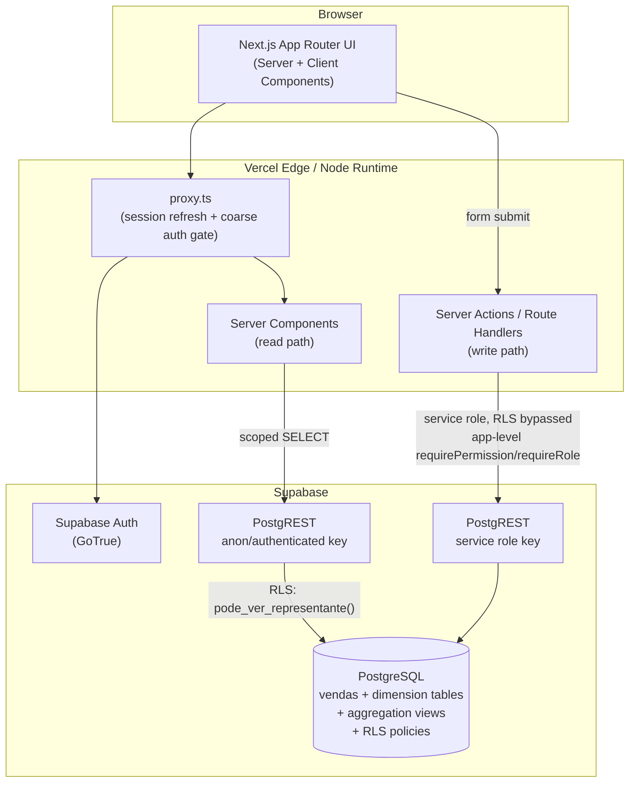
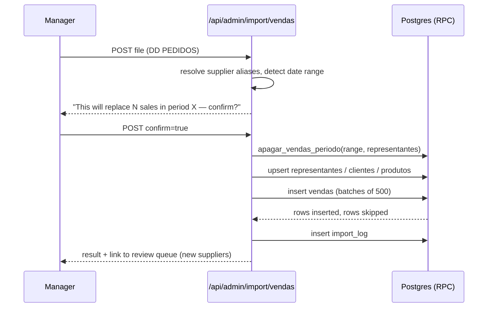
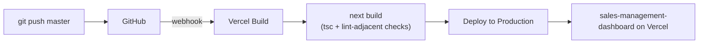

# Sales Management Dashboard

A commercial management platform for a distribution company, built to replace a monthly Excel-based sales
control process with a live, database-driven system. Every metric shown in the UI — positivação (active-client
count), goal attainment, financial totals, product distribution, rankings — is computed on demand from the raw
sales fact table, never copied between views.

[](https://nextjs.org/)
[](https://react.dev/)
[](https://www.typescriptlang.org/)
[](https://supabase.com/)
[](https://vercel.com/)

---

## Table of Contents

- [Project Overview](#project-overview)
- [Architecture](#architecture)
- [Technology Stack](#technology-stack)
- [Engineering Practices](#engineering-practices)
- [Features](#features)
- [Project Structure](#project-structure)
- [Data Flow](#data-flow)
- [Installation](#installation)
- [Database Design](#database-design)
- [Security](#security)
- [Testing Strategy](#testing-strategy)
- [Observability](#observability)
- [Deployment](#deployment)
- [Performance Considerations](#performance-considerations)
- [Technical Decisions](#technical-decisions)
- [Challenges and Lessons Learned](#challenges-and-lessons-learned)
- [Roadmap](#roadmap)
- [Contributing](#contributing)
- [License](#license)
- [Author](#author)

---

## Project Overview

### Executive Summary

The client's commercial team tracked monthly sales performance — client positivação, revenue vs. goal per
supplier, product distribution, sales-rep rankings, commission estimates — entirely inside a single Excel
workbook exported from their ERP. Every metric was a manual pivot table copied by hand into a "team" tab and
seven per-representative tabs. This dashboard replaces that workbook with a Next.js application backed by
Postgres (Supabase), keeping the exact visual language and metrics the team already understands, while
eliminating the manual copy step that caused the source data to diverge.

### Business Context

The client is a distributor operating with a small commercial team (a handful of sales representatives under
supervisors, reporting to a manager). Sales data is exported monthly from the ERP as a flat Excel file
(`DD PEDIDOS`, one row per invoiced order line). Historically, an analyst rebuilt the workbook's pivot tables
every month and manually copied totals across tabs — a process that produced three different positivação counts
in the same workbook for the same month (533 / 471 / 485), because each tab was an independent, occasionally
stale copy of the same underlying number.

### Technical Context

The system ingests the same raw ERP export the client already produces — no change to their upstream process is
required — and turns it into a normalized relational schema with a single fact table (`vendas`). All aggregates
are SQL views queried live by the UI. There is exactly one authoritative number per metric, computed the same
way every time it is requested.

### Main Objectives

- Eliminate metric divergence caused by manual pivot-table copies.
- Give each role (Manager / Supervisor / Vendedor) a scoped, authenticated view of only the data relevant to
  them, enforced at both the application and the database (RLS) layer.
- Turn configuration that used to be hardcoded in spreadsheet formulas or in application source (monthly goals,
  business-day counts, commission tiers) into database rows editable through an admin UI, with no redeploy
  required.
- Keep the monthly ERP re-import idempotent and safe to re-run.

### Key Benefits

- **Single source of truth.** No aggregate is ever stored or copied — positivação, distribuição, financeiro and
  rankings are always `SELECT`s over `vendas` or a view built on top of it.
- **Role-scoped access.** A sales rep cannot see another rep's data, in the UI or by forging a request directly
  against the API — enforced by Postgres Row-Level Security, not only by application code.
- **Non-destructive by default.** Only the sales import is delete-and-reinsert (and only for the affected date
  range); every other import (suppliers, clients, goals) is an additive upsert.
- **Zero-downtime configuration changes.** Monthly goals, business-day counts and commission tiers are database
  rows editable in an admin UI, not constants requiring a deploy.

---

## Architecture

**Architectural style:** Modular monolith, layered within a single Next.js application — React Server
Components as the default rendering mode, with Server Actions and Route Handlers as the only write path into the
database. There is no separate backend service; Supabase (managed Postgres + Auth + PostgREST) is the sole
external system of record.

Key patterns in use:

- **CQRS-flavored read path.** Reads go straight from Server Components to Postgres views (`vw_*`) via the
  anon/authenticated Supabase client, scoped by RLS. Writes never go through those views — they go through
  Server Actions calling the service-role client, which bypasses RLS deliberately and enforces authorization in
  application code (`requirePermission` / `requireRole`) instead.
- **Security via Row-Level Security, not query filtering.** Access scoping (`Vendedor` sees only their own
  `representante_id`; `Supervisor` sees an assigned subset) is enforced in Postgres via `SECURITY DEFINER`
  functions (`pode_ver_representante()`, `is_manager()`), not by trusting the client to only ask for its own
  data. This is what makes the system resilient to a forged request that bypasses the UI entirely.
- **Additive-upsert vs. delete-and-reinsert import strategy**, chosen per entity based on whether it has a
  reliable natural key (see [Data Flow](#data-flow)).
- **Live override pattern for unconfirmed metrics.** Where a number's exact ERP derivation was never confirmed
  with the client (e.g. `cadastro_total`, `base_ativa`, historical positivação), the schema stores a nullable
  override column: `NULL` means "compute live," a set value means "use this confirmed reference instead." This
  avoids hardcoding a guess while still letting the client pin a number they've verified.



### Layers

- **Presentation** — App Router pages/layouts (`src/app`), split into Server Components (default, all reads) and
  Client Components (forms, interactive tables — explicitly marked `"use client"`).
- **Application** — Server Actions (`src/app/(app)/admin/actions.ts` and per-feature `actions.ts` files) that
  validate input, check permissions, and orchestrate writes.
- **Domain** — Pure calculation logic with no I/O, e.g. `src/lib/comissao/calcular.ts` (commission-tier math).
- **Infrastructure** — Supabase clients (`src/lib/supabase*`), auth/session/permission resolution
  (`src/lib/auth/*`), import parsing (`src/lib/import/*`).
- **Data** — PostgreSQL schema and views, defined in `supabase_schema.sql` and the `supabase_migration_v*.sql`
  files, migrated forward incrementally and applied manually through the Supabase SQL Editor.

---

## Technology Stack

| Layer | Technology | Purpose |
|---|---|---|
| Language | TypeScript 5 | End-to-end static typing, App Router + Server Actions |
| Frontend Framework | Next.js 16 (App Router) | Server Components by default, file-based routing, Server Actions |
| UI Library | React 19 | Component model |
| Styling | Tailwind CSS v4 + shadcn/ui | Utility-first styling, accessible primitives (`@base-ui/react`) |
| Charts | Recharts | Rankings, distribution and evolution visualizations |
| Icons | Lucide React | Icon set |
| Theming | next-themes | Light/dark mode |
| Notifications | Sonner | Toast feedback for admin actions |
| Database | Supabase (PostgreSQL) | System of record — fact table, dimensions, aggregation views |
| Auth | Supabase Auth (GoTrue) | Email/password login, session cookies via `@supabase/ssr` |
| Authorization | Postgres RLS + `SECURITY DEFINER` functions | Row-level scoping by representative/supervisor, independent of app code |
| Data Access | `@supabase/supabase-js`, `@supabase/ssr` | Typed client (anon/authenticated) + service-role admin client |
| Excel Parsing | `xlsx` (SheetJS, pinned to the CDN-distributed 0.20.3) | Server-side parsing of ERP export files during import |
| Dates | date-fns | Business-day and period calculations |
| Hosting / CI-CD | Vercel (Git-integrated deploys) | Automatic deploy on push to `master` |
| Linting | ESLint 9 (`eslint-config-next`) | Static analysis, Next.js rules |
| Package Manager | npm | Dependency management |

There is no message broker, cache layer, or container runtime in this system — the workload (a few thousand
sales rows per month, single-tenant) doesn't justify the operational cost, and Supabase's managed Postgres
already provides connection pooling. See [Technical Decisions](#technical-decisions).

---

## Engineering Practices

- **Single source of truth over cached aggregates.** The project's one non-negotiable rule (see
  [`docs/04-regras-de-negocio.md`](docs/04-regras-de-negocio.md)): no computed metric is ever persisted. This is
  a direct, deliberate answer to the exact defect class (silently divergent copies) that motivated the rewrite.
- **Server Actions as the only write boundary.** Nothing in a Client Component ever holds the service-role key;
  all authorization (`requirePermission`, `requireRole`) is checked server-side, and RLS provides a second,
  independent enforcement layer in case an authorization check is ever missed in application code.
- **Non-destructive imports by default.** Only the entity without a reliable natural key (`vendas`) uses
  delete-and-reinsert, and only for the affected date range. Every other import is an idempotent upsert.
- **Config over hardcoding.** Monthly goals, business-day counts, and commission tiers are rows in `periodos`,
  `metas`, and `comissao_faixas` — editable through an admin UI, never constants in source requiring a deploy.
- **SOLID / dependency inversion at the boundary.** Server Components and Actions depend on the Supabase client
  abstractions in `src/lib/supabase*`, not on `supabase-js` calls scattered inline — swapping the underlying
  client library would touch one module, not every page.
- **Repeatable security audits over one-time manual checks.** `scripts/security_audit_rls_anon.mjs` and
  `scripts/security_audit_scope_forgery.mjs` are meant to be re-run against production after every RLS change,
  not just once at launch — see [Security](#security).
- **Documentation as an artifact of decisions, not an afterthought.** `docs/PENDENCIAS.md` is a running,
  dated log of every open question, decision, and reversal made during development (including at least one
  decision that was later found wrong and explicitly reverted — see
  [Challenges and Lessons Learned](#challenges-and-lessons-learned)) — closer to an ADR log than a changelog.

---

## Features

### Current Features

- [x] Email/password login (Supabase Auth) with a forced first-login password change flow (no SMTP in the
      project, so there's no self-service "forgot password" — a manager issues a temporary password instead)
- [x] Role-based access control — Manager / Supervisor / Vendedor — with a per-module, per-role-or-per-user
      permission matrix editable in `/admin/permissoes`
- [x] Row-Level Security scoping on `vendas`/`clientes`/`metas` so a Vendedor only ever sees their own
      representative's rows and a Supervisor only the representatives assigned to them, enforced independently
      of the application (`pode_ver_representante()`)
- [x] Team/rep scorecards (`/equipe`, `/equipe?rep=<id>`) — goals, positivação, financials, all computed live
- [x] Top 20 Clientes / Top 10 Vendedores rankings, positivação and financial rankings
- [x] Product distribution and Curva ABC de Produtos (not present in the original spreadsheet — added as a
      commercial-management best practice)
- [x] Commission/premiação estimate based on configurable attainment tiers (`comissao_faixas`)
- [x] Manual sale entry (`/admin/vendas`) for field corrections and Vendedor-entered sales, immune to the
      monthly ERP re-import (tagged `origem='manual'`)
- [x] Manual, editable returns (devoluções) entry, separate from read-only ERP-sourced returns
- [x] Four independent Excel import pipelines (sales, suppliers, clients, goals), each with column guardrails,
      a downloadable template, and a persisted audit trail (`import_log`)
- [x] Full CRUD admin screens for goals, suppliers, clients, representatives, and monthly periods — everything
      that used to be hardcoded
- [x] Contextual in-app help ("How to use this screen") across 25 screens
- [x] Repeatable, scriptable security audits for anonymous-access leaks and cross-representative scope leaks

### Planned Features

- [ ] Confirm and implement the final commission formula (CLT vs. PJ contract type, positivação-based premium,
      whether the three premium types stack or are exclusive) — currently stored but not fully computed
- [ ] Historical data import (`/evolucao`) covering sales history since Jan/2024, currently a placeholder
- [ ] Access/change audit log for sensitive data (commission percentages, permissions, goals)

### Future Roadmap

- [ ] Managed backups / point-in-time recovery (currently unavailable on the Supabase free tier)
- [ ] MFA enforcement for privileged (Manager) accounts
- [ ] Automated regression tests (see [Testing Strategy](#testing-strategy) for current, manual-only coverage)

---

## Project Structure

```text
dashboard/
├── src/
│   ├── proxy.ts                        # Session refresh + coarse route gate (Next 16 middleware successor)
│   ├── app/
│   │   ├── login/                      # /login — email/password, outside the authenticated layout group
│   │   ├── trocar-senha/               # Forced password change, outside (app) on purpose (avoids RLS-recursion-style loops)
│   │   ├── (app)/                      # Everything behind login shares this layout
│   │   │   ├── layout.tsx              # Resolves profile + permissions, renders AppShell/Sidebar
│   │   │   ├── page.tsx                # Dashboard hub
│   │   │   ├── equipe/                 # Team/rep scorecards (role-scoped)
│   │   │   ├── comissoes/              # Commission/premiação report
│   │   │   ├── analitico/              # Line-item sales, per-client, daily revenue, returns
│   │   │   ├── produtos/               # Curva ABC de Produtos
│   │   │   ├── rankings/               # positivação, financeiro, clientes, vendedores
│   │   │   ├── distribuicao/           # Product distribution by supplier
│   │   │   ├── evolucao/               # Historical trend (placeholder, phase 2)
│   │   │   ├── conta/                  # Self-service display name / password change
│   │   │   ├── docs/                   # In-app user manual (login, roles, monthly routine, security)
│   │   │   └── admin/
│   │   │       ├── actions.ts          # All write Server Actions (service role, permission-guarded)
│   │   │       ├── usuarios/, permissoes/   # Manager-only: user management, permission matrix
│   │   │       ├── comissoes/          # Commission tier CRUD
│   │   │       ├── vendas/             # Manual sale entry
│   │   │       └── importar/           # Import hub (see Data Flow)
│   │   └── api/
│   │       ├── admin/import/           # 5 import endpoints (vendas/fornecedores/clientes/metas/metas_representante)
│   │       └── download-template/      # Column-template downloads for each import type
│   ├── components/
│   │   ├── layout/                     # Sidebar, AppShell, contextual help
│   │   └── ui/                         # shadcn/ui primitives
│   └── lib/
│       ├── supabase.ts                 # Legacy anon client (kept only where no session scoping is needed)
│       ├── supabase/{server,client}.ts # Session-aware Supabase clients (@supabase/ssr) — preferred entry point
│       ├── supabaseAdmin.ts            # Service-role client (server-only, bypasses RLS)
│       ├── auth/{session,permissions,redirecionamento}.ts  # getCurrentProfile, requirePermission/requireRole
│       ├── comissao/calcular.ts        # Commission-tier calculation (pure function)
│       └── import/                     # expectedColumns.ts + shared parse/upsert/log helpers
├── scripts/
│   ├── seed_metas_v1.mjs               # One-time seed of goals from the original spreadsheet
│   ├── seed_first_manager.mjs          # One-time seed of the first Manager login
│   ├── security_audit_rls_anon.mjs     # Confirms no table leaks data to an unauthenticated request
│   └── security_audit_scope_forgery.mjs # Confirms Vendedor/Supervisor can't read outside their scope
├── docs/                               # Architecture, schema, import flow, business rules, layout inventory
├── supabase_schema.sql                 # Base schema
└── supabase_migration_v1*.sql, v2*.sql # Incremental migrations, applied manually via the Supabase SQL Editor
```

### Layer responsibilities

- **`app/`** — presentation and routing. Server Components read directly from Supabase views; the small subset
  needing interactivity (forms, filters) are Client Components.
- **`app/(app)/*/actions.ts`** — application layer. Every write path: validates input, calls
  `requirePermission`/`requireRole`, then writes via the service-role client.
- **`lib/comissao/`** — domain layer. Pure functions with no I/O, unit-testable in isolation.
- **`lib/supabase*`, `lib/auth/`, `lib/import/`** — infrastructure layer. Everything that talks to an external
  system (Postgres, Auth, file parsing) is isolated here rather than inlined in pages.

---

## Data Flow

### Read path (any dashboard screen)

1. Request hits `proxy.ts`, which refreshes the Supabase session cookie and redirects to `/login` if there's no
   session.
2. `(app)/layout.tsx` resolves the current user's profile and permission matrix; `requirePageAccess` denies
   (redirecting to `/?sem-acesso=<module>`) if the resolved role/user lacks access to that module.
3. The Server Component queries a Postgres view (e.g. `vw_positivacao_representante`) through the
   session-scoped Supabase client.
4. Postgres RLS applies `pode_ver_representante()` to the query transparently — a Vendedor's query and a
   Manager's identical query return different row sets from the same view, with no `WHERE` clause difference in
   application code.
5. Server Component renders HTML with the scoped result; no client-side fetch, no unscoped data ever reaches
   the browser.

### Write path (e.g. editing a goal)

1. A Client Component form calls a Server Action (e.g. `admin/actions.ts`).
2. The action calls `requirePermission("admin.metas", "editar")` — a role/user without that permission gets a
   thrown error, not a silently ignored write.
3. On success, the action uses the service-role Supabase client (`supabaseAdmin.ts`), which bypasses RLS by
   design — authorization for this path lives entirely in the `requirePermission` check, not in a policy.
4. The action revalidates the affected route so the next render reflects the change immediately.

### Monthly ERP import (the one destructive path)

1. Manager/Supervisor uploads the raw `DD PEDIDOS` export at `/admin/importar`.
2. The route resolves each row's supplier via `fornecedor_aliases`; an unrecognized ERP supplier name is
   auto-created as `[Revisar] <name>` rather than silently dropping the row, and queued for review.
3. The route reports the detected date range and requires an explicit `confirm=true` before writing — the only
   one of the four import types that mutates existing rows.
4. Dimension tables are upserted first (`representantes` → `clientes` → `produtos`), never overwriting a
   manually-set `representante_id`/`status`.
5. Existing `vendas` rows in the detected date range (for the affected representatives, `origem='erp'` only) are
   deleted via the `apagar_vendas_periodo` RPC, then all rows are re-inserted in batches of 500 — re-importing
   the same file is idempotent, and a mid-batch failure just requires re-uploading the same file.
6. Rows missing a valid client/product/date are excluded and counted (`linhas_ignoradas`), never silently
   dropped.
7. The outcome is recorded in `import_log` and shown in the "Últimas importações" panel on the same screen.



---

## Installation

### Prerequisites

- Node.js 20+
- npm
- A Supabase project (PostgreSQL + Auth)

### Clone Repository

```bash
git clone https://github.com/fabricio-hunt/sales-management-dashboard.git
cd sales-management-dashboard
```

### Install Dependencies

```bash
npm install
```

### Environment Variables

Copy `.env.example` to `.env.local` and fill in your Supabase credentials:

```bash
cp .env.example .env.local
```

```env
NEXT_PUBLIC_SUPABASE_URL=https://your-project.supabase.co
NEXT_PUBLIC_SUPABASE_ANON_KEY=your-publishable-key
# Server-only — never prefix with NEXT_PUBLIC_. All writes (import, goals, admin CRUD)
# go through Server Actions/Route Handlers using this key, since RLS only allows SELECT.
SUPABASE_SERVICE_ROLE_KEY=your-service-role-key

# Optional — only used by scripts/security_audit_scope_forgery.mjs.
TEST_MANAGER_EMAIL=
TEST_MANAGER_PASSWORD=
TEST_SUPERVISOR_EMAIL=
TEST_SUPERVISOR_PASSWORD=
TEST_VENDEDOR_EMAIL=
TEST_VENDEDOR_PASSWORD=
```

### Database Setup

Run, in order, in the **Supabase SQL Editor**:

1. `supabase_schema.sql` — base tables.
2. `supabase_migration_v1.sql` — goals/suppliers/periods tables, aggregation views, RLS lockdown, import RPCs.
3. `supabase_migration_v1_1.sql` — `import_log` table (import history/audit).
4. `supabase_migration_v2.sql` — login/RBAC (`profiles`, `permissoes_role`/`permissoes_usuario`,
   `supervisor_representantes`), scoped RLS on `vendas`/`clientes`, positivação override column, commission
   tiers (`comissao_faixas`), `vw_top_clientes_mes`.
5. `supabase_migration_v2_1.sql` through `v2_4.sql` — manual-sale origin tracking, RLS/RBAC hardening (closes an
   anonymous-read gap on 7 legacy tables — see [Security](#security)), and supporting fixes.

Then seed the current month's goals from the spreadsheet (one-time, idempotent):

```bash
node scripts/seed_metas_v1.mjs
```

Create the first Manager account (required — the app has no public signup):

```bash
node scripts/seed_first_manager.mjs <email> <password> "<name>"
```

Log in at `/login` with that account, then use `/admin/usuarios` to create Supervisors/Vendedores and
`/admin/permissoes` to adjust what each role/user can see.

### Local Development

```bash
npm run dev
```

Open [http://localhost:3000](http://localhost:3000).

### Production Deployment

The project deploys automatically to Vercel on every push to `master` via the GitHub integration — no separate
CI/CD configuration file. `SUPABASE_SERVICE_ROLE_KEY` and the two `NEXT_PUBLIC_*` variables must be set in the
Vercel project's Environment Variables (a missing service-role key breaks every write path in production without
breaking reads, so it fails somewhat silently — worth checking first if imports/admin writes 500 in prod).

---

## Database Design

### Main Entities

- **Dimensions:** `representantes`, `clientes` (assigned to a `representante_id`, never overwritten by import
  once set manually), `fornecedores`, `fornecedor_aliases` (maps the ERP's messy legal names to a canonical
  supplier), `produtos`.
- **Fact table:** `vendas` — one row per invoiced order line (`venda_liq`, `qtde`, `data_venda`,
  `is_positivacao`, `origem` [`erp`/`manual`], foreign keys to the three dimensions above).
- **Monthly configuration** (replaces what used to be hardcoded): `periodos` (business days, date range per
  month), `metas` (goal per representative × supplier × month), `metas_representante` (non-per-supplier
  objectives and manual overrides), `comissao_faixas` (commission attainment tiers).
- **Access control:** `profiles` (role + `representante_id` for a Vendedor), `supervisor_representantes`
  (Manager-assigned scope for a Supervisor), `modulos`/`permissoes_role`/`permissoes_usuario` (the
  view/edit permission matrix).
- **Audit:** `import_log` — one row per import execution, with counts and outcome.

### Relationships

`vendas` is the single fact table; every reporting screen either queries it directly (filtered/paginated) or
queries one of six aggregation views built on top of it (`vw_realizado_rep_fornecedor`,
`vw_realizado_equipe_fornecedor`, `vw_faturamento_diario`, `vw_positivacao_representante`,
`vw_financeiro_representante`, `vw_vendas_cliente_dia`, `vw_top_clientes_mes`). All views are declared with
`security_invoker = true`, so they inherit the querying user's RLS scope instead of running with view-owner
privileges — a view is not a way to bypass row-level security here.

### Data Model Decisions

- **Nullable override columns instead of hardcoded confirmed values.** `metas_representante.cadastro_total`,
  `base_ativa`, and `positivacao_realizado_override` are `NULL` by default (compute live) and can be set to a
  client-confirmed reference number without touching application code.
- **`vendas.origem` distinguishes ERP-sourced from manually-entered rows** specifically so the monthly
  delete-and-reinsert import can never silently discard a manually corrected sale or return.
- **No aggregate table.** There is deliberately no `positivacao_mensal` or similar rollup table — this is the
  central lesson from the original spreadsheet's divergent numbers (see
  [Challenges and Lessons Learned](#challenges-and-lessons-learned)).

Full DDL: `supabase_schema.sql` and `supabase_migration_v1.sql`/`v2*.sql`. Narrative description:
[`docs/02-banco-de-dados.md`](docs/02-banco-de-dados.md).

---

## Security

- **Authentication:** Supabase Auth (GoTrue), email/password. Public signup is explicitly disabled at the
  provider level (`disable_signup: true`) — the app only ever calls `admin.createUser` (Manager-only), so an
  open signup endpoint had no legitimate use and was closed after being found active during an audit.
- **Authorization — defense in depth, not a single layer:**
  1. **Application layer:** `requirePermission`/`requireRole` (`src/lib/auth/permissions.ts`) gate every page
     and Server Action against a per-role/per-user permission matrix.
  2. **Database layer (Row-Level Security):** independent of the application. `pode_ver_representante()` and
     `is_manager()` are `SECURITY DEFINER` Postgres functions that scope every `SELECT` on
     `vendas`/`clientes`/`metas`/`metas_representante`/`profiles`/etc. to what the authenticated user is allowed
     to see — verified by directly querying PostgREST with a Vendedor's session and confirming zero rows outside
     their `representante_id`.
  3. **No write policies exist for `authenticated`/`anon` on any table.** All writes go through the
     service-role key, used exclusively server-side in Server Actions/Route Handlers — never in a client bundle.
- **Secrets management:** the service-role key lives only in server-side environment variables (Vercel project
  settings / `.env.local`, gitignored); the browser bundle only ever receives the anon/publishable key.
- **Open-redirect protection:** `next=` login redirect and the equivalent `/conta` field are validated by
  `caminhoInternoSeguro()` (`src/lib/auth/redirecionamento.ts`), which rejects protocol-relative URLs (`//evil.com`),
  backslash variants (`/\evil.com`), absolute schemes, and control characters — added after an internal audit
  found the naive `next.startsWith("/")` check insufficient (see
  [Challenges and Lessons Learned](#challenges-and-lessons-learned)).
- **Encryption in transit:** HTTPS/TLS enforced end-to-end via `supabase-js`/PostgREST; the codebase never opens
  a direct Postgres connection.
- **Encryption at rest:** managed by Supabase (AES-256 on the underlying Postgres storage), outside application
  configuration.
- **Column-level encryption (`pgcrypto`) deliberately not enabled** for current data: CNPJ is already public
  record (queryable via Receita Federal); commission percentages are protected by RLS, and encrypting that
  column would break the live aggregation views that read it. Documented as a trigger to revisit if a genuinely
  sensitive column (e.g. a bank account for commission payout) is added later.
- **Repeatable audit scripts** — meant to be re-run after any RLS change, not just once:

  ```bash
  node scripts/security_audit_rls_anon.mjs       # confirms no table leaks data without a session
  node scripts/security_audit_scope_forgery.mjs  # confirms Vendedor/Supervisor can't read outside their scope
  ```

- **Input validation:** import routes validate column presence against an explicit expected-schema list
  (`src/lib/import/expectedColumns.ts`) before writing anything; rows missing required fields are excluded and
  counted rather than causing a partial, silent write.
- **Known open items:** MFA on the project owner's account is not yet enabled (manual step); the Supabase free
  tier has no automated backups/PITR (a billing decision pending with the client); cross-role scope-forgery
  testing (`security_audit_scope_forgery.mjs`) is blocked in production until real Supervisor/Vendedor accounts
  exist to test against. Tracked in [`docs/PENDENCIAS.md`](docs/PENDENCIAS.md).

---

## Testing Strategy

There is currently no automated test suite (no Jest/Vitest/Playwright configuration in the repository). Quality
is enforced through:

- **Static analysis:** `npm run lint` (ESLint 9, `eslint-config-next`) and the TypeScript compiler
  (`npx tsc --noEmit`) — both run clean before every deploy.
- **Manual, scripted security verification** against production data — the two `scripts/security_audit_*.mjs`
  scripts are effectively integration tests for the RLS layer, run directly against PostgREST with real
  role-scoped credentials rather than mocks, specifically because a mocked RLS layer would not have caught the
  anonymous-read regression described below.
- **Manual end-to-end verification before each deploy** — documented per-session in
  [`docs/PENDENCIAS.md`](docs/PENDENCIAS.md) and consolidated into a formal [`docs/roteiro-aceitacao.md`](docs/roteiro-aceitacao.md)
  (client acceptance test script) covering per-role screen checks and a security walkthrough.

```bash
npm run lint
npx tsc --noEmit
npm run build
node scripts/security_audit_rls_anon.mjs
node scripts/security_audit_scope_forgery.mjs   # requires TEST_* accounts in .env.local
```

Automated regression tests are tracked as future work — see [Roadmap](#roadmap).

---

## Observability

There is no dedicated observability stack (no Grafana/Datadog/OpenTelemetry) — appropriate for the current scale
(a single-tenant internal tool with a small user base), but the project does maintain:

- **Vercel's built-in deployment logs and function logs** for runtime errors in Server Actions/Route Handlers.
- **A persisted, queryable audit trail for imports** (`import_log` — success/failure, row counts, affected
  period, arbitrary `jsonb` detail), surfaced directly in `/admin/importar` rather than requiring log access.
- **`getCurrentProfile()` logs auth/profile-resolution errors** instead of silently discarding them — a
  deliberate fix after a discarded Postgres error (`error` destructured away, only `data` kept) masked an RLS
  recursion bug that made login unusable in production for a full day (see
  [Challenges and Lessons Learned](#challenges-and-lessons-learned)).

Adding structured logging/alerting is noted as future work once the client's usage volume justifies the
operational overhead.

---

## Deployment

- **Hosting:** Vercel, Git-integrated — every push to `master` triggers an automatic build and deploy.
- **Pipeline:** no separate CI file; `next build` (which runs the TypeScript check) is the build gate, and
  `npm run lint`/`tsc --noEmit` are run manually before pushing.
- **Runtime constraint:** the import routes run on the Node.js runtime (`runtime = "nodejs"`), not Edge, because
  they depend on `xlsx` parsing that isn't Edge-compatible.
- **External build dependency:** `xlsx` is installed from `cdn.sheetjs.com` rather than npm (the npm package is
  unmaintained and carries an unpatched high-severity vulnerability) — the Vercel build environment must be able
  to reach that host.



---

## Performance Considerations

- **Server Components by default.** Only screens with forms/interactivity ship client-side JavaScript; every
  read-only report renders server-side with no client-side data-fetching waterfall.
- **Views over application-side aggregation.** Positivação, financials, and distribution are aggregated in
  Postgres (`vw_*` views), not fetched row-by-row and reduced in JavaScript — the database does the work it's
  best at, and the app never pages large result sets just to sum them.
- **Batched inserts on import.** The sales import writes in batches of 500 rows rather than one large insert or
  one row at a time, balancing transaction size against round-trip count.
- **Scoped queries via RLS, not larger unscoped queries filtered client-side** — a Vendedor's query never
  fetches other representatives' rows and discards them; Postgres never returns them in the first place.
- **Cost:** the entire stack (Vercel hobby/pro tier + Supabase free/pro tier) is sized for a single-tenant
  internal tool with a few thousand sales rows per month — no infrastructure is provisioned ahead of actual load.

---

## Technical Decisions

**Why Supabase instead of a self-managed Postgres + custom auth service?**
The team needed authentication, row-level authorization, and a Postgres database, with no dedicated backend
engineer to operate infrastructure. Supabase bundles managed Postgres, Auth (GoTrue), and PostgREST behind one
project, letting RLS policies double as the authorization layer instead of building a separate authorization
service — directly enabling the "defense in depth" model described in [Security](#security).

**Why compute everything live in SQL views instead of a scheduled aggregation job?**
The system exists specifically to fix a class of bug (divergent copies of the same metric) caused by
pre-computed, periodically-refreshed numbers going stale relative to their source. A view has no staleness
window by construction. The tradeoff — every page load re-runs an aggregation query — is acceptable at this
data volume (thousands, not millions, of rows) and is revisited only if it stops being true.

**Why Row-Level Security instead of filtering every query in application code?**
Scoping in application code only protects requests that go through the intended code path. RLS scopes the data
at the database boundary, so even a Server Action with a missing permission check, or a request forged directly
against PostgREST, still can't read outside the caller's assigned scope. This was validated directly, not just
assumed — see the scope-forgery audit script and the production verification logged in
[`docs/PENDENCIAS.md`](docs/PENDENCIAS.md) (manager: 7443/7443 rows; a test Vendedor: their own subset, zero
rows outside it).

**Why delete-and-reinsert for sales but upsert for everything else?**
`vendas` has no reliable natural key coming out of the ERP export. Suppliers, clients, and goals do
(`nome_fantasia`, `Cód. Pessoa`, `mês + representante + fornecedor`), so upsert is both correct and
non-destructive for them — the worst case of a bad file is an overwritten field, never data loss for rows the
file didn't mention. Sales, lacking that key, has to fully replace the affected period to stay correct on
re-import, which is why it's the one import that requires explicit confirmation.

**Why nullable override columns instead of hardcoding a client-confirmed number?**
Several derived numbers (`cadastro_total`, `base_ativa`, a historical positivação count) had ERP derivations
that were never fully confirmed with the client. Hardcoding a guess would silently reintroduce the exact
divergence problem this project exists to solve. A nullable override lets a confirmed value be pinned per
representative without touching source code, while defaulting to a transparent live calculation everywhere else.

**Why `xlsx` from SheetJS's CDN instead of the npm package?**
The npm-published `xlsx` package is unmaintained and carries an unpatched high-severity vulnerability
(prototype pollution + ReDoS). SheetJS distributes patched releases only via their own CDN. Pinning to that CDN
URL was the tradeoff accepted to close the vulnerability without forking the parser — the cost is a hard
dependency on `cdn.sheetjs.com` being reachable at build time.

---

## Challenges and Lessons Learned

- **The exact bug this project exists to fix, reproduced in the new system before launch.** During the first
  real-data import, `/equipe` computed a positivação of 471, contradicting an earlier "confirmed" value of 485.
  Investigation showed 485 came from cross-checking two spreadsheet tabs that turned out to have identical
  values row-by-row — not two independent sources, so the original "cross-validation" never actually validated
  anything. The 485 decision was explicitly reverted in `docs/PENDENCIAS.md` rather than left standing, and the
  system kept computing the value live either way — the correct behavior regardless of which number is
  eventually confirmed with the client. **Lesson:** a live, single-formula calculation surfaces this class of
  discrepancy immediately, instead of letting two silently-copied numbers disagree indefinitely.

- **A Postgres RLS policy took production login down for a full day.** A `profiles` SELECT policy tested "is
  this user a manager?" with a subquery against `profiles` itself; Postgres re-applies RLS to that subquery,
  producing `42P17 infinite recursion detected in policy`. The failure was invisible in the UI because the
  calling code discarded the Postgres error (`const { data } = await ...`, never checking `error`) and treated
  `null` as "not logged in," triggering a silent login redirect loop. Fixed by moving the check into a
  `SECURITY DEFINER` function (`is_manager()`) that bypasses RLS for that specific lookup, and by logging the
  error instead of swallowing it. **Lesson:** an error path that discards its error is itself a bug waiting to
  hide the next one — restored as a standing practice in `getCurrentProfile()`.

- **An open redirect that looked like a correct check.** `redirect(next.startsWith("/") ? next : "/")` looks
  safe, but `//evil.com` also starts with `/` and browsers resolve it as `https://evil.com` (a
  protocol-relative URL); `/\evil.com` has the same effect because several browsers normalize the backslash
  before resolving it. This is a classic pattern in redirect-validation code that's worth checking for anywhere
  a `next=`/`redirect=` query parameter feeds a `Location` header. Fixed with an explicit denylist of
  protocol-relative, backslash, absolute-scheme, and control-character variants, kept as a numeric code-point
  comparison rather than a regex character class after discovering that writing `[\x00-\x1F]` literally in the
  source file wrote actual control bytes (including a NUL byte) into the file.

- **RLS policies without an explicit `TO` clause default to `PUBLIC`, which includes `anon`.** An early
  migration wrote `FOR SELECT USING (true)` policies with no `TO` clause on 7 tables (including `metas`, which
  carries commission percentages). Because the publishable anon key ships in the browser bundle, this was a
  real anonymous data leak in production, found by directly querying PostgREST with no session token at all.
  **Lesson:** an RLS policy's `TO` clause is not optional boilerplate — omitting it is a distinct failure mode
  from omitting RLS entirely, and it doesn't show up in any UI-level test because the app itself was always
  logged in when anyone checked.

- **A hub-and-spoke import architecture replaced two dead-end approaches.** The project went through
  client-side inserts (no server-side validation or audit trail) and a Python/`pandas`-based import via
  `child_process` (incompatible with a serverless runtime like Vercel) before settling on the current design:
  independent Node.js route handlers per entity, each with its own guardrails, sharing only the audit-log
  pattern. Neither earlier approach is speculative history — both existed in the codebase and were removed.

Full session-by-session decision log, including items still open: [`docs/PENDENCIAS.md`](docs/PENDENCIAS.md).

---

## Roadmap

#### v1.0 — Live reporting foundation (shipped)
- [x] Normalized schema replacing the spreadsheet's flat export
- [x] Four independent, non-destructive-by-default import pipelines
- [x] Full parity with the original spreadsheet's screens, computed live

#### v2.0 — Access control (shipped)
- [x] Supabase Auth login, RBAC (Manager/Supervisor/Vendedor)
- [x] Row-Level Security scoping independent of application code
- [x] Manual sale/return entry as a correction path outside the monthly import
- [x] Full RLS/anonymous-access security audit and remediation

#### v3.0 — Commission finalization & historical data (in progress)
- [ ] Confirm and implement the final commission formula with the client (CLT/PJ, positivação premium, stacking rules)
- [ ] Import historical data (since Jan/2024) to unblock the `/evolucao` trend view
- [ ] Sensitive-data access audit log
- [ ] Automated regression test suite

See [`docs/PENDENCIAS.md`](docs/PENDENCIAS.md) for the granular, dated backlog behind this roadmap.

---

## Contributing

This is currently a single-client engagement without an open external contributor base, but the project follows
standard open-source hygiene for anyone working on it:

1. Fork the repository and create a feature branch from `master`.
2. Follow the existing layering: reads in Server Components against views, writes only through Server
   Actions/Route Handlers behind `requirePermission`/`requireRole`.
3. Run `npm run lint`, `npx tsc --noEmit`, and `npm run build` before opening a PR — all three must pass clean.
4. If the change touches RLS or the permission matrix, re-run both `scripts/security_audit_*.mjs` scripts
   against a non-production Supabase project and note the result in the PR description.
5. Use [Conventional Commits](https://www.conventionalcommits.org/) (`feat`, `fix`, `refactor`, `docs`, `chore`,
   …) for commit messages.
6. Open a PR describing objective, technical changes, impact, and how it was tested.

---

## License

Distributed under the MIT License.

```text
MIT License

Copyright (c) 2026 Fabricio Barauna

Permission is hereby granted, free of charge, to any person obtaining a copy
of this software and associated documentation files (the "Software"), to deal
in the Software without restriction, including without limitation the rights
to use, copy, modify, merge, publish, distribute, sublicense, and/or sell
copies of the Software, and to permit persons to whom the Software is
furnished to do so, subject to the following conditions:

The above copyright notice and this permission notice shall be included in all
copies or substantial portions of the Software.

THE SOFTWARE IS PROVIDED "AS IS", WITHOUT WARRANTY OF ANY KIND, EXPRESS OR
IMPLIED, INCLUDING BUT NOT LIMITED TO THE WARRANTIES OF MERCHANTABILITY,
FITNESS FOR A PARTICULAR PURPOSE AND NONINFRINGEMENT. IN NO EVENT SHALL THE
AUTHORS OR COPYRIGHT HOLDERS BE LIABLE FOR ANY CLAIM, DAMAGES OR OTHER
LIABILITY, WHETHER IN AN ACTION OF CONTRACT, TORT OR OTHERWISE, ARISING FROM,
OUT OF OR IN CONNECTION WITH THE SOFTWARE OR THE USE OR OTHER DEALINGS IN THE
SOFTWARE.
```

---

## Author

**Fabricio Barauna**
Software Engineer

- GitHub: [github.com/fabricio-hunt](https://github.com/fabricio-hunt)
- LinkedIn: _add your profile URL_
- Portfolio: _add your portfolio URL_
